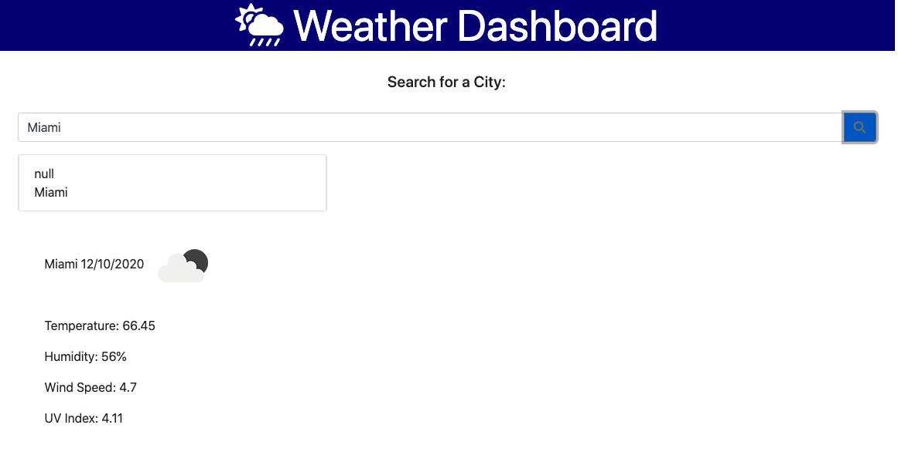
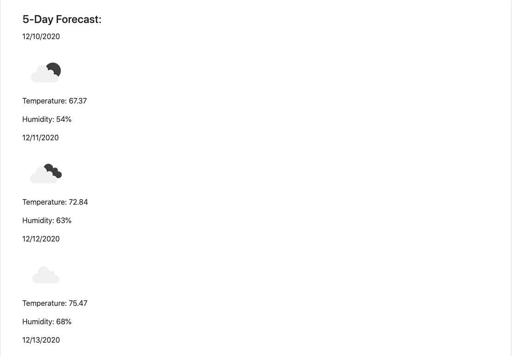

# Weather Dashboard
Server-Side APIs

## Ryan Curtin's Weather Dashboard Links:
* [Weather Dashboard GitHub Page](https://github.com/rpc08002/Weather-Dashboard)
* [Weather Dashboard Live Webpage](https://rpc08002.github.io/Weather-Dashboard/)

### Mock-Up

### Summary
* Weather Dashboard provides the current forecast and five day forecast for your convenience of any city in the United States.
* HTML is used to provide the initial layout of the web page.
* JavaScript/jQuery are used to append elements to the page.
* A user's search history is saved to local storage below the search bar.
* Two Ajax functions are called to the Open Weather Map API in order to pull the weather information with the "GET" method.
* Bootstrap was utilized for the responsive web layout.
* Font Awesome was used for the logos on the page.

### Features
* HTML Page
* JavaScript Page
* CSS Page
* OpenWeatherMap API